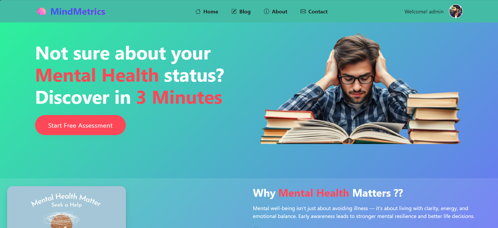

#  **🧠 MindMetrics: AI-Powered Student Mental Health Prediction System**




## **🌟 Introduction**
**MindMetrics** is an advanced AI system developed by our team to predict **depression, anxiety, and stress levels** in students using machine learning. Our comprehensive solution helps educational institutions identify at-risk students early and provide data-driven interventions.

---

## 🚀 Live Demo

🔗 [**Click Here to Explore It Visulaly**](https://mind-metrics-v1.onrender.com/)

---

<p align="center">
  <a href="https://mind-metrics-v1.onrender.com/">
    
  </a>
</p>

---

📱 Optimized for all screen sizes — mobile, tablet, and desktop

---
🔹 **Key Advantages:**
- **Triple Prediction Model:** Simultaneously assesses depression, anxiety, and stress
- **Early Intervention:** Identifies warning signs before crises occur
- **Personalized Insights:** Tailored recommendations based on severity levels
- **Privacy-First:** Secure data handling with anonymized reporting

## **✨ Key Features**

### **Core Prediction Capabilities**
| Feature | Description | Technology |
|---------|-------------|------------|
| **Depression Detection** | Predicts mild/moderate/severe levels | Multioutput Regression (AdaBoost) (73.86% accuracy) |
| **Anxiety Analysis** | Identifies low/medium/high anxiety | Multioutput Regression (GradientBoosting) (73.43% accuracy) |
| **Stress Evaluation** | Measures academic/personal/social stress | Multioutput Regression (XGB) (73.36% accuracy) |
| **Interactive Dashboard** | Real-time visualization of mental health trends | Django + Bootstrap |

### **System Highlights**
✅ Multi-factor analysis (academics, sleep, social life, Family involvement)  
✅ Personalized student profiles  
✅ Semester-over-semester trend tracking  
✅ Secure data encryption  

## **👥 Our Team**
| Role | Members | Contributions |
|------|---------|---------------|
| **ML Engineers** | Sreyash, Debanjan, Bhaskar | Developed prediction models |
| **Backend Devs** | Sudip, Debprasad | Built API & database |
| **Frontend Team** | Debprasad, Sudip | Created dashboard UI |
| **Data Analysts** | Bhaskar, Debanjan | Processed datasets |

## **🛠️ Tech Stack**
- **Frontend:** Django, Bootstarp
- **Backend:** Python
- **ML Models:** Scikit-learn, TensorFlow
- **Database:** PostgreSQL
- **Deployment:** Render, Cloudinary, NeonDB

## **📊 Prediction Workflow**
1. **Data Collection:** Anonymous surveys (PHQ-9, GAD-7, PSS adapted)
2. **Feature Analysis:**
   - Academic performance
   - Social engagement
   - Sleep patterns
   - Self-reported moods
3. **ML Prediction:** Three specialized models working in tandem
4. **Visualization:** Interactive dashboard with risk indicators


## **🚀 Getting Started**
### **For Educators**
1. Upload student data (CSV/Excel)
2. Schedule regular assessments
3. Monitor dashboard alerts

### **For Developers**
```bash
# Clone repository
git clone https://github.com/Debprasad77/MindMetrics.git

# Set up environment
cd MindMetrics
python -m venv venv
source venv/bin/activate  # Linux/Mac
venv\Scripts\activate    # Windows

# Install dependencies
pip install -r requirements.txt

# Run system
python manage.py runserver
```

## **📜 Ethical Guidelines**
🔒 All predictions are anonymized  
⚠️ Not a diagnostic tool - always consult professionals  
📊 Transparent model explanations available  
🛡️ GDPR-compliant data practices  

## **📬 Contact Us**
📧 Email: debprasad7047@gmail.com  
🌐 Website: [mind-metrics-v1.onrender.com](https://mind-metrics-v1.onrender.com/)  

---

**💙 "Supporting student well-being through ethical AI"**  
